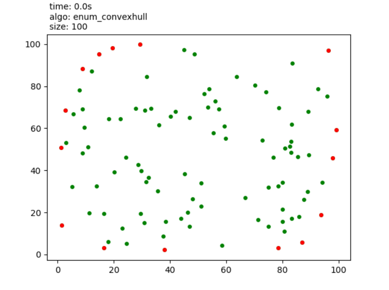
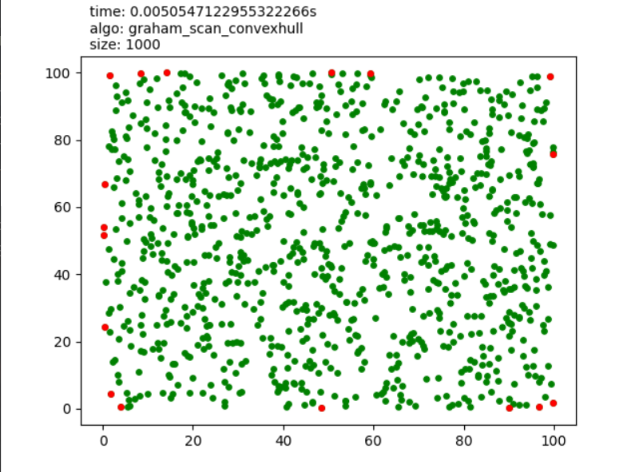
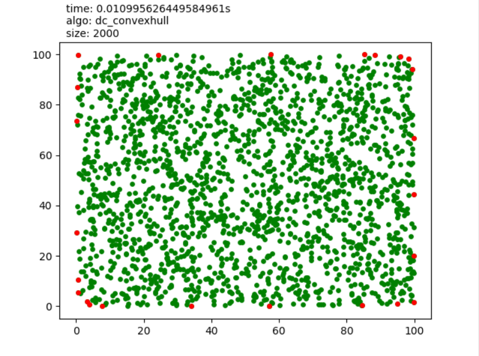
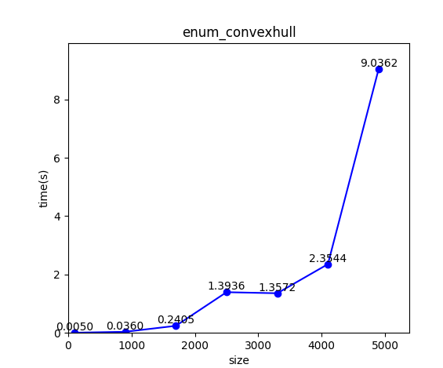
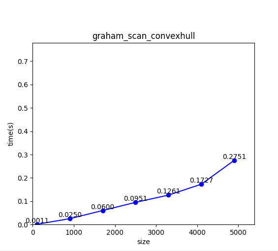
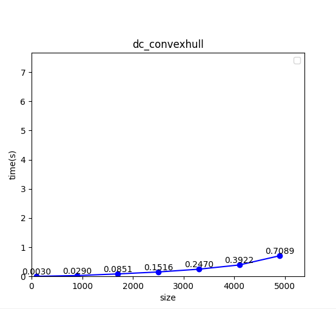

# Lab1：分治算法

包含如下文件。PDF 由 VSCode 拓展 Markdown-All-in-One 导出。

```
.
├── dc_convexhull.py           # 分治算法实现
├── enum_convexhull.py         # 枚举算法实现
├── graham_scan_convexhull.py  # Graham-Scan算法实现
├── pointset.py                # 点集合生成算法
├── main.py                    # 
├── lab1.pdf                   # 实验报告，README.md 导出 PDF
└── README.md                  # 
```

## 实验目的

- 掌握分治算法的设计思想与方法
- 熟练使用高级编程语言实现分治算法
- 通过对比简单算法以及不同的分治求解思想，理解算法复杂度。

## 实验问题

求解凸包问题：输入是平面上N个点的集合Q，输出一个Q的凸包。其中，Q的凸包是一个凸多边形P，Q中的点在P上或在P中。

## 实验步骤

### 实现基于枚举的凸包求解算法

朴素思想：若Q中某点位于Q中其他三点构成的三角形内，则该点必不可能在凸包内。穷举选点，最终得到凸包。

以下代码片，判断点在三角形内外。

```python
def tri_inside(a, b, c, d):
    vec_a_b = inner_prod(a, b, d)
    vec_c_b = inner_prod(b, c, d)
    vec_a_c = inner_prod(c, a, d)
  
    if vec_a_b >= 0:
        if vec_a_c >= 0:
            if vec_c_b >= 0:
                return True
    else:
        if vec_a_c <= 0:
            if vec_c_b <= 0:
                return True
    return False
```

### 实现基于Graham_Scan的凸包求解算法

Graham-Scan算法思想：按照极角大小进行排序，并维护一个栈用于算法的判断和凸包数据的存储。首先将边界点加入凸包，一旦新点构成非逆（顺）时针旋转，则更新栈状态。

Graham-Scan算法相较于枚举算法，提高了效率。

```python
# 栈状态维护
for vec in vec_lst:
    while rotate(chull[-2], chull[-1], vec) <= 0:
        chull.pop()
        if len(chull) <= 2: break
    chull.append(vec)
```

### 实现基于分治的凸包求解算法

快速凸包思想：根据x轴坐标进行排序，找到中间点；分别对左集合和右集合递归地执行分治算法，并合并左右两侧凸包。算法复杂度为 nlogn。递归的结束条件为点数 n <= 2。

## 实验结果

### 程序运行

```python
python main.py --size 1000 --algo graham_scan_convexhull
```

- `--size` 指定点集合大小
- `--algo` 指定算法实现
- `--perf` 是否进行性能比较

### 执行结果

分别以三种算法计算凸包，结果如下。

<!-- 

 -->

<div align="center">
  
</div>

<div align="center">
  
</div>

<div align="center">
  
</div>

### 性能测试

比较三种算法在不同数据量下的执行效率，结果如下。

<!-- 

 -->

<div align="center">
  
</div>

<div align="center">
  
</div>

<div align="center">
  
</div>

### 时间复杂度分析

基于枚举的时间复杂度为 O(n^4)，这是由于遍历所有点，故效率较低，适用于小数据量。

基于 Graham-Scan 的凸包求解算法首先根据极角进行排序，然后遍历，时间复杂度为 O(nlogn)。

基于分治思想的凸包求解算法时间复杂度也为 O(nlogn)。
