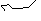

# Lab2：搜索算法

包含如下文件。PDF 由 VSCode 拓展 Markdown-All-in-One 导出。

```
.
├── pixels_map_*.png  # 输出
├── s_astar.py        # 单向 A_Star
├── s_t_astar.py      # 双向 A_Star
├── tools.py          # 生成邻接表
├── main.py           # 
├── lab2.pdf          # 实验报告，README.md 导出 PDF
└── README.md         # 
```

## 实验目的

- 掌握搜索算法的基本设计思想与方法
- 掌握 A* 算法的设计思想与方法
- 熟练使用高级编程语言实现搜索算法
- 利用实验测试给出的搜索算法的正确性

## 实验问题

寻路问题，输入一个方格表示的地图，要求用 A* 算法找到并输出从起点（S）到终点（T）的代价最小的路径。

有如下条件及要求。

- 每一步都落在方格中，而不是横竖线的交叉点
- 障碍处无法通行
- 在每个格子处，若无障碍，下一步可以达到八个相邻的格子，并且只可以到达无障碍的相邻格子。其中，向上、下、左、右四个方向移动的代价为 1，向四个斜角方向移动的代价为√2
- 在一些特殊格子上行走要花费额外的地形代价
- 经过一条路径总的代价为移动代价+地形代价

## 实验步骤

### 单向 A* 算法

启发式搜索：自初始节点执行算法。维护两个数据结构：

- `visited: Heap` → 记录已访问节点
- `unvisited: Map`

算法循环至当前节点，搜索可行域并扩展已保存路径。堆结构自动维护并弹出代价最小的节点 min_dot，进行新一轮迭代。当路径包含终点 T 时，返回优化解。

本实验中有 `f(n) = g(n) + h(n)`，其中 g(n) 为优化路径代价，h(n) 为启发搜索代价，定义为欧氏距离。

### 双向 A* 算法

分别从起点 S 和终点 T 执行 A* 算法。代价函数对称定义。当两个 `visited Heap`相交，算法结束。

### 测试 A* 算法应用

`tools.py`包含了实验给定的两个邻接矩阵的生成方法，以及简单的可视化程序。

## 实验结果

### 程序运行

```python
python main.py --algo s_astar --map map_1
```

- `--algo` 指定算法实现
- `--map` 指定地图

### 执行结果

分别以单向/双向 A* 算法运行地图，控制台打印路径，并进行了简单的可视化。

- ```
  > python main.py --algo s_astar --map map_1
  start = (8, 4)
  end = (9, 13)
  path = [(8, 4), (8, 5), (8, 6), (7, 6), (6, 7), (7, 8), (7, 9), (8, 10), (8, 11), (8, 12), (9, 13)]
  ```

<div align="center">
  
</div>

- ```
  > python main --algo s_t_astar --set map_2
  start = (10, 4)
  end = (0, 35)
  path = [(10, 4), (9, 4), (8, 3), (7, 2), (6, 1), (5, 1), (5, 2), (5, 3), (5, 4), (5, 5), (5, 6), (4, 7), (4, 8),
          (5, 9), (6, 10), (7, 11), (8, 12), (8, 13), (8, 14), (8, 15), (8, 16), (8, 17), (8, 18), (8, 19), (8, 20),
          (8, 21), (8, 22), (7, 23), (7, 24), (7, 25), (7, 26), (7, 27), (7, 28), (6, 29), (5, 30), (4, 31), (3, 32),
          (2, 33), (1, 34), (0, 35)]
  ```

<div align="center">
  
</div>
