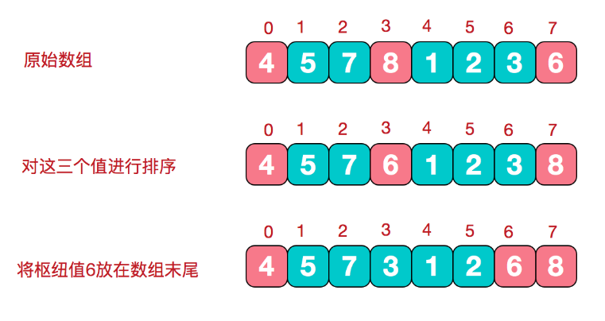
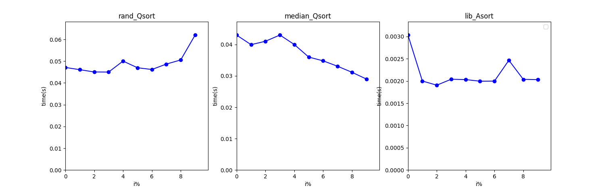

# Lab5：快速排序

包含如下文件。PDF 由 VSCode 拓展 Markdown-All-in-One 导出。

```
.
├── rand_quick_sort.py  # 教程伪代码实现
├── ad_quick_sort.py    # 基于三数取中法优化的快速排序
├── lib_quick_sort.py   # array.sort()包装
├── dataset.py          # 生成i%重复的数据集
├── main.py             # 
├── lab5.pdf            # 实验报告，README.md 导出 PDF
└── README.md           # 
```

## 实验目的

- 掌握快速排序随机算法的设计思想与方法
- 熟练使用高级编程语言实现不同的快速排序算法
- 利用实验测试给出不同快速排序算法的性能以理解其优缺点

## 实验问题

快速排序是算法导论中的经典算法。在本实验中，给定一个长为 n 的整数数组，要求将数组升序排序。

## 实验步骤

### 算法导论伪代码实现

实现为 `rand_quick_sort`，包含了随机划分与快速排序。不稳定（更改了数组元素）。

```python
# 随机选取主元逻辑
if p < r:
    i = random.randint(p, r)
    data[i], data[r] = data[r], data[i]
    pivot = data[r]
    i = p - 1
```

### 算法优化

根据算法定义实现 `rand_quick_sort`，通过一趟排序将待排数组分隔成独立的两部分，其中一部分的值均比另一部分记小。然后对这两个子数组继续进行递归排序，直到整个序列有序。

最坏情况下，时间复杂度退化至 O (nlogn)。

为改善算法性能，考虑采取**三数取中**：从序列中随机选择三个元素并排序，选择中位元素作为 pivot。好处是可以避免在极端情况下（已经有序）选择逆向极端值，从而导致时间复杂度退化。

<div align="center">
  
</div>

图源 [https://www.cnblogs.com/chengxiao/p/6262208.html](https://www.cnblogs.com/chengxiao/p/6262208.html)

三数取中法在 `ad_quick_sort` 中实现。

## 实验结果

### 程序运行

```python
python main.py --algo rand_quick_sort
```

- `--algo` 指定算法实现
- `--perf` 是否执行性能测试

### 执行结果

初始化 `N = 20000`，在不同元素重复率下执行，结果如下。

<div align="center">
  
</div>

虽然进行了优化，但与库函数实现的快速排序仍有较大差距。另外，数据存在较大波动，可能是由于数据量选取偏小。
